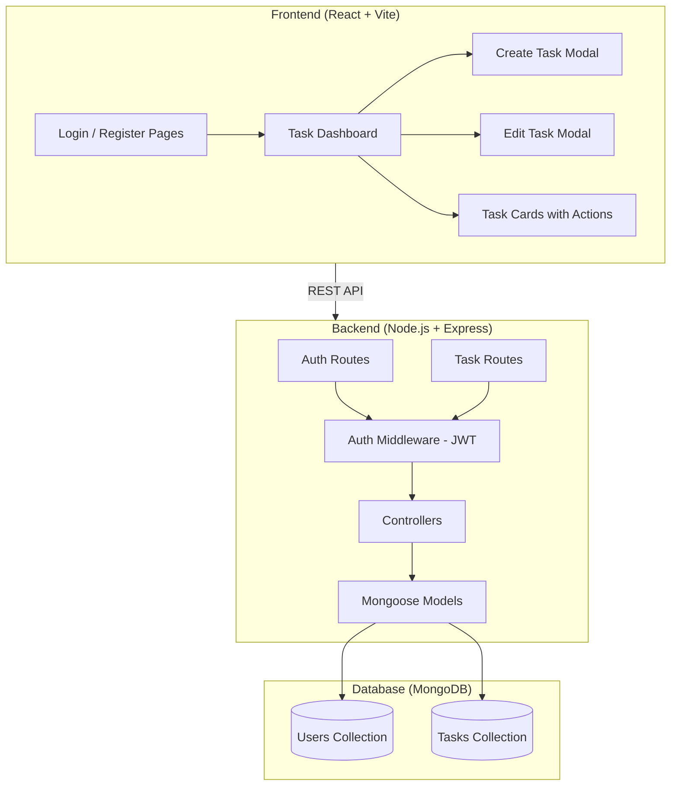

# Task Manager App - Full Stack Implementation Plan

A full-stack Task Manager application with JWT authentication, CRUD operations, React frontend, Node.js/Express backend, and MongoDB database — built for a virtual web development internship project.

---

## Architecture Overview



## Tech Stack

| Layer | Technology | Purpose |
|-------|-----------|---------|
| Frontend | React 18 + Vite | UI framework & build tool |
| Styling | Vanilla CSS | Premium dark-themed UI |
| Backend | Node.js + Express | REST API server |
| Auth | JWT + bcryptjs | Token-based authentication |
| Database | MongoDB + Mongoose | Data persistence & ODM |
| HTTP Client | Axios | API requests from frontend |
| Dev Tools | Concurrently, Nodemon | Development workflow |

---

## Project Structure

```
project3/
├── client/                    # React Frontend (Vite)
│   ├── public/
│   ├── src/
│   │   ├── assets/            # Static assets
│   │   ├── components/        # Reusable UI components
│   │   │   ├── Navbar.jsx
│   │   │   ├── TaskCard.jsx
│   │   │   ├── TaskForm.jsx
│   │   │   ├── TaskModal.jsx
│   │   │   ├── ProtectedRoute.jsx
│   │   │   └── Loader.jsx
│   │   ├── pages/             # Page-level components
│   │   │   ├── Login.jsx
│   │   │   ├── Register.jsx
│   │   │   └── Dashboard.jsx
│   │   ├── context/           # React Context for auth state
│   │   │   └── AuthContext.jsx
│   │   ├── services/          # API service layer
│   │   │   └── api.js
│   │   ├── App.jsx
│   │   ├── App.css
│   │   ├── index.css
│   │   └── main.jsx
│   ├── index.html
│   ├── vite.config.js
│   └── package.json
│
├── server/                    # Node.js Backend
│   ├── config/
│   │   └── db.js              # MongoDB connection
│   ├── middleware/
│   │   └── auth.js            # JWT verification middleware
│   ├── models/
│   │   ├── User.js            # User schema
│   │   └── Task.js            # Task schema
│   ├── routes/
│   │   ├── auth.js            # Login/Register routes
│   │   └── tasks.js           # CRUD task routes
│   ├── controllers/
│   │   ├── authController.js  # Auth logic
│   │   └── taskController.js  # Task CRUD logic
│   ├── server.js              # Express app entry point
│   └── package.json
│
├── .env                       # Environment variables
├── package.json               # Root package.json (scripts)
└── README.md
```

---

## Proposed Changes

### Component 1: Backend — Server Setup & Database

#### [NEW] server/package.json
- Express, Mongoose, JWT, bcryptjs, cors, dotenv, nodemon dependencies

#### [NEW] server/server.js
- Express app initialization
- CORS configuration (allow frontend origin)
- JSON body parser middleware
- MongoDB connection on startup
- Mount auth & task routes
- Listen on port 5000

#### [NEW] server/config/db.js
- Mongoose connection function using `MONGO_URI` from `.env`
- Connection error handling with graceful exit

---

### Component 2: Backend — User Authentication (JWT)

#### [NEW] server/models/User.js
```javascript
// Schema fields:
{
  name: String (required),
  email: String (required, unique),
  password: String (required, hashed),
  createdAt: Date (default: now)
}
```
- Pre-save hook to hash password with bcryptjs
- Instance method `matchPassword()` to compare passwords

#### [NEW] server/controllers/authController.js
- **POST /api/auth/register** — Create user, return JWT token
- **POST /api/auth/login** — Validate credentials, return JWT token
- **GET /api/auth/me** — Get current user profile (protected)
- JWT token generation helper: signs `{ id: user._id }` with `JWT_SECRET`, expires in 30 days

#### [NEW] server/routes/auth.js
- Route definitions for register, login, and profile endpoints

#### [NEW] server/middleware/auth.js
- Extract token from `Authorization: Bearer <token>` header
- Verify token with `jwt.verify()`
- Attach `req.user` with user data from DB
- Return 401 if no token or invalid token

---

### Component 3: Backend — Task CRUD Operations

#### [NEW] server/models/Task.js
```javascript
// Schema fields:
{
  user: ObjectId (ref: 'User', required),
  title: String (required),
  description: String,
  status: String (enum: ['pending', 'in-progress', 'completed'], default: 'pending'),
  priority: String (enum: ['low', 'medium', 'high'], default: 'medium'),
  dueDate: Date,
  createdAt: Date (default: now)
}
```

#### [NEW] server/controllers/taskController.js
- **GET /api/tasks** — Get all tasks for authenticated user (with filtering & sorting)
- **POST /api/tasks** — Create new task for authenticated user
- **PUT /api/tasks/:id** — Update task (only if owned by user)
- **DELETE /api/tasks/:id** — Delete task (only if owned by user)

#### [NEW] server/routes/tasks.js
- All routes protected with auth middleware
- Route definitions for CRUD operations

---

### Component 4: Frontend — React App Setup (Vite)

#### [NEW] client/ (Vite + React project)
- Initialize with `npx create-vite` using React template
- Install dependencies: `axios`, `react-router-dom`, `react-icons`, `react-hot-toast`

#### [NEW] client/vite.config.js
- Proxy `/api` requests to `http://localhost:5000` for dev

---

### Component 5: Frontend — Authentication UI

#### [NEW] client/src/context/AuthContext.jsx
- React Context for global auth state
- `user`, `token`, `loading` state
- `login()`, `register()`, `logout()` functions
- Persist token in localStorage
- Auto-load user profile on app mount if token exists

#### [NEW] client/src/services/api.js
- Axios instance with base URL
- Request interceptor to attach JWT token from localStorage
- API functions: `loginUser()`, `registerUser()`, `getProfile()`
- API functions: `getTasks()`, `createTask()`, `updateTask()`, `deleteTask()`

#### [NEW] client/src/pages/Login.jsx
- Premium dark-themed login form with email & password
- Animated gradient background
- Link to register page
- Form validation & error handling with toast notifications

#### [NEW] client/src/pages/Register.jsx
- Registration form with name, email, password, confirm password
- Same premium styling as login
- Link to login page

#### [NEW] client/src/components/ProtectedRoute.jsx
- Wrapper component that redirects to login if not authenticated

---

### Component 6: Frontend — Task Dashboard

#### [NEW] client/src/pages/Dashboard.jsx
- Main task management dashboard
- Header with user greeting, logout button
- Task statistics cards (total, pending, in-progress, completed)
- Filter/sort controls (by status, priority, date)
- Task list grid with TaskCard components
- Floating "Add Task" button

#### [NEW] client/src/components/Navbar.jsx
- App logo/name
- User info & logout button
- Responsive hamburger menu

#### [NEW] client/src/components/TaskCard.jsx
- Card-style task display with:
  - Title, description (truncated)
  - Status badge (color-coded)
  - Priority indicator
  - Due date
  - Edit & Delete action buttons
  - Status toggle dropdown
- Hover animations & glassmorphism effect

#### [NEW] client/src/components/TaskModal.jsx
- Modal overlay for creating/editing tasks
- Smooth slide-in animation
- Form fields: title, description, status, priority, due date
- Form validation

#### [NEW] client/src/components/TaskForm.jsx
- Reusable form component used inside TaskModal
- Controlled form inputs with proper styling

#### [NEW] client/src/components/Loader.jsx
- Premium animated loading spinner

---

### Component 7: Frontend — Styling

#### [NEW] client/src/index.css
- CSS custom properties (design tokens):
  - Dark theme color palette with purple/blue accents
  - Typography: Google Font "Inter"
  - Spacing, border-radius, shadow scales
- Global resets & base styles
- Glassmorphism utility classes
- Smooth animations & transitions
- Responsive breakpoints

#### [NEW] client/src/App.css
- Page-specific layouts and component styles
- Login/Register page styles
- Dashboard grid layout
- Task card styles with hover effects
- Modal styles with backdrop blur
- Form input styles
- Badge/status styles
- Mobile responsive styles

---

### Component 8: Root Configuration

#### [NEW] .env
```
MONGO_URI=mongodb://localhost:27017/taskmanager
JWT_SECRET=your_jwt_secret_key_here
PORT=5000
```

#### [NEW] package.json (root)
- Scripts to run client, server, and both concurrently
- `npm run dev` — runs both frontend & backend

#### [NEW] README.md
- Project description, setup instructions, API docs, screenshots section

### Component 10: Frontend — Landing Page & UI Revamp (Stitch Luminous Focus)

#### [MODIFY] [Landing.jsx](file:///c:/Users/Rishav/OneDrive/Desktop/syntex/project3/client/src/pages/Landing.jsx)
- **Interactive Mock Dashboard**:
  - Replace the static preview card placeholder with a gorgeous, CSS-animated mockup dashboard representing the actual TaskSphere workspace.
  - Mockup features: sidebar, header with profile and search bar, stats (circular ring chart, progress bar), board columns (Pending, In Progress, Completed), and animated priority tasks.
- **Bento Grid Micro-Interactions**:
  - **Status Toggler**: Implement an interactive mini task item list. Clicking its status tag cycles between Pending, In Progress, and Completed states instantly with corresponding colors.
  - **Live Filter & Search**: A miniature task filter. Typing in the search input dynamically filters a set of mock tasks.
  - **Priority Chips**: Glow on hover and animate on click.
  - **Session Persistence**: Animated lock opening and pulsing green connection dot.

#### [MODIFY] [Login.jsx](file:///c:/Users/Rishav/OneDrive/Desktop/syntex/project3/client/src/pages/Login.jsx) & [Register.jsx](file:///c:/Users/Rishav/OneDrive/Desktop/syntex/project3/client/src/pages/Register.jsx)
- Apply the Luminous Focus design system to the authentication screens.
- Enhance the `.auth-card` to use the sky-blue tinted glass border and subtle blue background glow.
- Make the logo and title text use the sky-blue to violet gradient.
- Add floating abstract shapes or moving glowing rings in the background to create high-end visual interest.

#### [MODIFY] [Dashboard.jsx](file:///c:/Users/Rishav/OneDrive/Desktop/syntex/project3/client/src/pages/Dashboard.jsx)
- Style the desktop sidebar navbar as a vertical glass pane with sky blue margins and glows.
- Style task columns, stats widgets, search/filters, and inputs using the dark-blue theme base and glowing borders.

#### [MODIFY] [index.css](file:///c:/Users/Rishav/OneDrive/Desktop/syntex/project3/client/src/index.css) & [App.css](file:///c:/Users/Rishav/OneDrive/Desktop/syntex/project3/client/src/App.css)
- Revise colors: Change background from flat charcoal (`#131315`/`#0e0e10`) to rich dark blue-violet radial gradient (`radial-gradient(circle at 50% -20%, #1a1b35 0%, #0d0e1b 60%, #05060b 100%)`).
- Revise cards: Apply glassmorphism with sky-blue borders (`rgba(123, 208, 255, 0.15)`) and micro-glowing box-shadows.
- Revise buttons: Implement blue-accented linear gradients (`#00c6ff` to `#0072ff`) with glowing hover shadows.
- Revise inputs: Darker blue glass backgrounds with cyan focus outline glows.

---

## Verification Plan

### Manual Verification
1. **Landing Page**: Check that the WebGL shader runs correctly and has vibrant colors. Verify the mock dashboard preview rendering and bento grid interactive toggles (status cycler, list filtering).
2. **Auth Flow**: Navigate to `/login` and `/register`. Verify the layout is balanced, elements don't overlap, and form validation is styled correctly.
3. **Dashboard**: Log in and verify that the sidebar, statistics grid, search bar, status dropdown, priority tags, and floating action button look modern, vibrant, and cohesive.
4. **Mobile Responsiveness**: Verify that the landing page and dashboard elements reflow beautifully on mobile viewports.

### Build Verification
```bash
cd client && npm run build   # Verify production build succeeds
```
